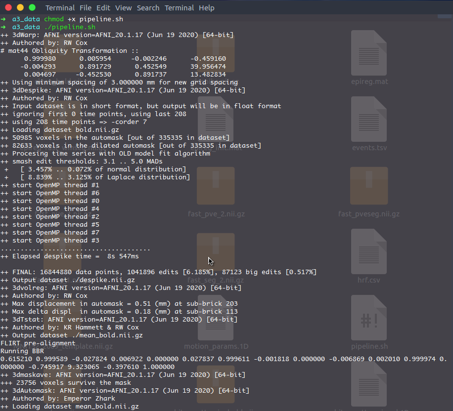
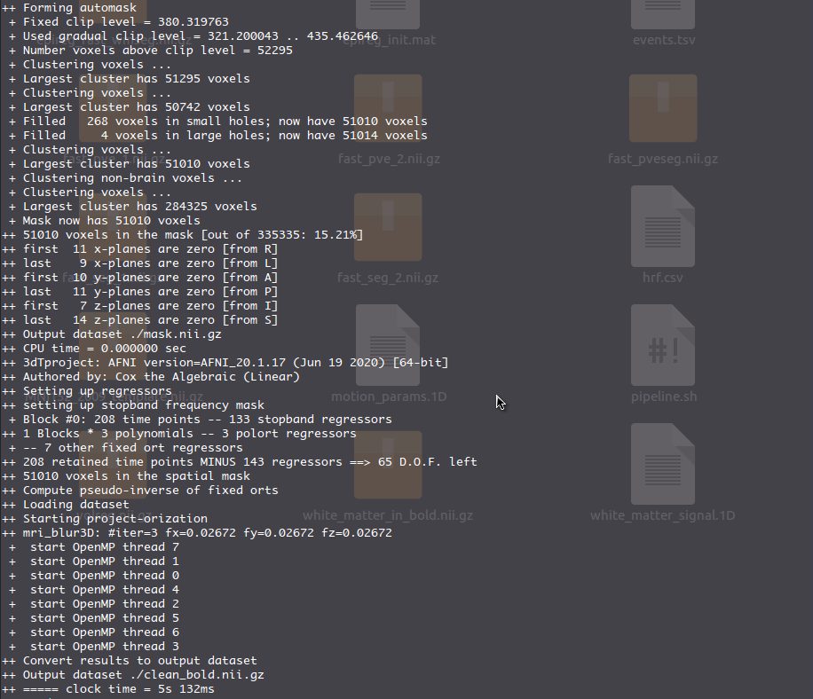
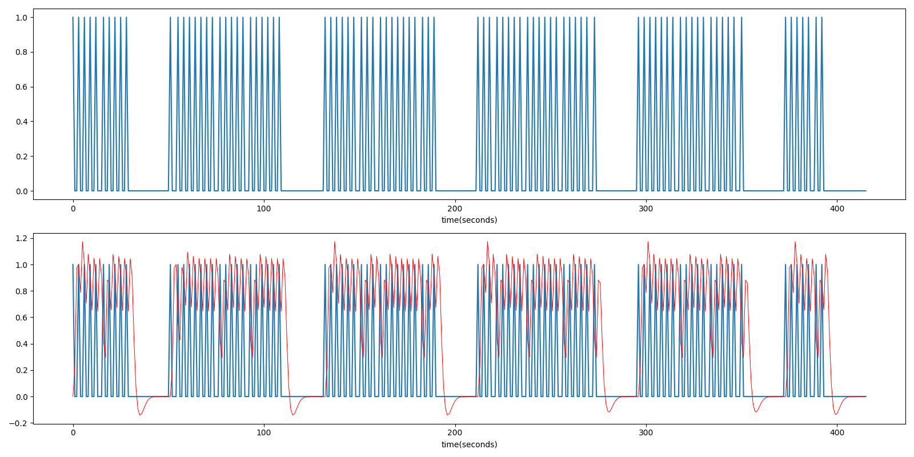
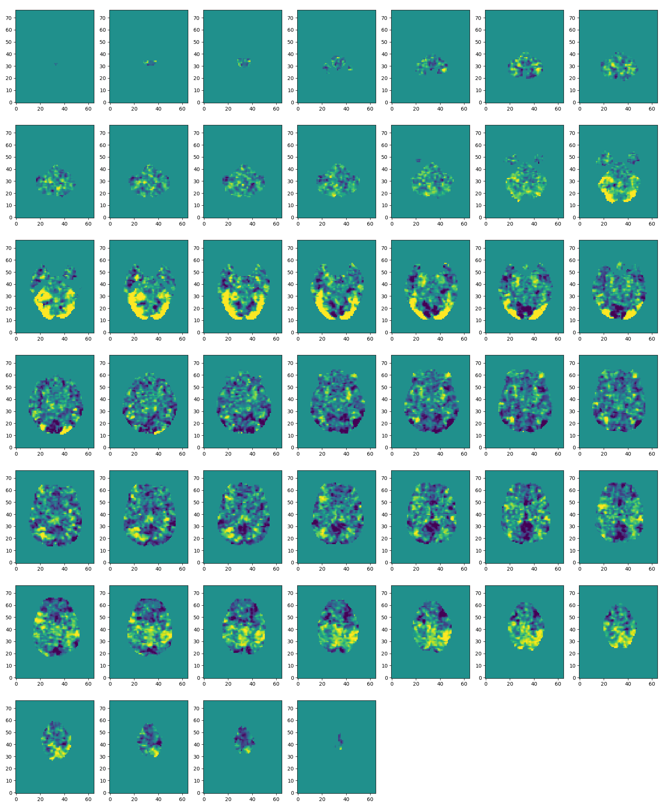
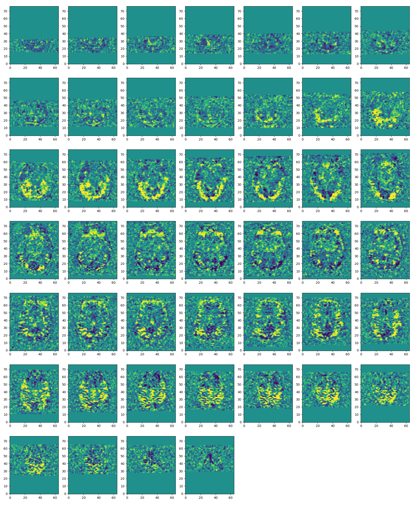

# CS463/516 Medical Imaging - Assignment 3

## Group members: Wentao Lu (002276355), Yi Ren (002269013)

## Part 1: f-MRI image basic pre-processing

The provided shell script `pipeline.sh` contains all the necessary steps to preprocess our raw 4D f-MRI image `bold.nii.gz` (EPI distortion correction, rigid body head motion correction, nuisance regression + bandpass filtering, spatial smoothing, etc). After [FSL](https://fsl.fmrib.ox.ac.uk/fsl/fslwiki) and [afni](https://afni.nimh.nih.gov/pub/dist/doc/htmldoc/index.html) have been installed on the computer, we can run this pipeline script from the terminal which will output a denoised version of the image called `clean_bold.nii.gz`.






## Part 2: localize task activation

Now that we have cleaned our BOLD image, we load it into Python to perform task-based analysis.

**1** - Create an ideal time series that represents how the brain should react to the stimulus

<details>
<summary>View code</summary>

```python
task = pd.read_csv('lab3/data/events.tsv', delimiter='\t').to_numpy()
tr = fmri.header.get_zooms()[3]  # repetition time
n = int(tr * fmri.shape[3])      # number of seconds in the time series
ts = np.zeros(n)                 # initialize the time series

stimuli = ('FAMOUS', 'UNFAMILIAR', 'SCRAMBLED')  # stimulus type we are interested in
mask = np.isin(task[:, 3], stimuli)              # filter out the tasks of interest
for onset in task[mask][:, 0]:
    ts[int(onset)] = 1
```
</details>

**2** - Convolve the ideal time series with the hemodynamic response function (HRF)

<details>
<summary>View code</summary>

```python
hrf = pd.read_csv('lab3/data/hrf.csv', header=None)
hrf = hrf.to_numpy().reshape(len(hrf),)
convolved = signal.convolve(ts, hrf, mode='full')
convolved = convolved[0:len(ts)]
```
</details>

**3** - Correlate the convolved triggers with the BOLD signal in each voxel

<details>
<summary>View code</summary>

```python
def corr_volume(im, cv):
    """Compute correlation between an fMRI image and a time series in each voxel"""
    ci = im - np.expand_dims(np.mean(im, 3), 3)
    cc = cv - np.mean(cv)
    corr = np.sum(ci * cc, 3) / (np.sqrt(np.sum(ci * ci, 3) + 1e-14) *
                                 np.sqrt(np.sum(cc * cc) + 1e-14))
    return corr

convolved = convolved[0::2]  # tr = 2 seconds per volume
corr_map = corr_volume(fmri.get_fdata(), convolved)
```
</details>

Ideally, a stimulus triggers the subject's response immediately, which gives rise to the blue curve in the figure below. After convolved with the hrf function, it's a little bit delayed and smoothed, as shown in red.



However, the brain's reaction can be quite different in reality, so we want to figure out how the time series in each voxel of the brain correlates to that ideal time series. A high correlation indicates that part of the brain is activated in the presence of the stimulus, and vice versa. In the figure below, we have plotted the correlation map in all axial slices corresponding to the brain's reaction to the stimuli. As we can see, correlation is most prominent around the back of neck. 



Now, if we repeat the same steps above based on the raw f-MRI image without pre-processing, the BOLD signals would contain much more noises. In the figure below, it's clear to see that noises dominate most signals. Even outside the brain, there are still some voxels where high correlation has been observed, which is due to the artifacts in the image data.

In specific, some slices with low correlations previously are now observing much higher correlations contributed by noises (the first row). On the other hand, certain slices with high correlations previously have now been attenuated to some degree (the third row), although we can still see the correlations, they are not as bright and closely clustered as before, since they are contaminated by noises.



## Part 3: multi-subject analysis

In this part, we use the dataset from [openneuro](https://openneuro.org/datasets/ds000117/versions/1.0.3) which contains MRI scans from 16 subjects. While data for multiple BOLD f-MRI runs are available, we are using only the first run.

For the purpose of batch processing, we wrote a shell script to automate download from the website as well as the pre-processing per subject. Each subject's data is stored in a separate folder coupled with a copy of `pipeline.sh`.

<details>
<summary>View code</summary>

```bash
echo "Creating data folders for multiple subjects......"
CWD=$(pwd)
cd "$CWD/data"
mkdir sub{01..16}

echo "Copying pipeline.sh to each folder......"
for i in {01..16}
do
  cp "$CWD"/data/pipeline.sh "$CWD"/data/sub$i/pipeline.sh
done

# use `httpie` to download data
url_folder="https://openneuro.org/crn/datasets/ds000117/snapshots/1.0.3/files"
function download_file {
    printf "\nDownloading t1.nii.gz ..."
    time http $url_folder/sub-$1:ses-mri:anat:sub-$1_ses-mri_acq-mprage_T1w.nii.gz > "$CWD"/data/sub$1/t1.nii.gz
    printf "\nDownloading bold.nii.gz ..."
    time http $url_folder/sub-$1:ses-mri:func:sub-$1_ses-mri_task-facerecognition_run-01_bold.nii.gz > "$CWD"/data/sub$1/bold.nii.gz
    printf "\nDownloading events.tsv ..."
    time http $url_folder/sub-$1:ses-mri:func:sub-$1_ses-mri_task-facerecognition_run-01_events.tsv > "$CWD"/data/sub$1/events.tsv
}

function preprocess {
    printf "\nPre-processing bold.nii.gz for subject $i ..."
    bash "$CWD"/data/sub$1/pipeline.sh
}

for i in {01..16}
do
  echo "Downloading data for subject $i"
  download_file $i
  echo "++++++++++++++++++++++++++++++++++++++++++++++"
done

for i in {01..16}
do
  (  # pipeline.sh is dependent on path, so must run in a subshell
  cd "$CWD/data/sub$i"
  preprocess $i
  )
done
```
</details>

This step takes around 1.5 hours to run, after that, each subject's folder will have a cleaned f-MRI image `clean_bold.nii.gz` as well as a bunch of others.

Next, we feed this data to Python. In a for loop, for every subject we run the correlation analysis as in part 2. The output correlation map is then transformed back into the f-MRI space and saved to disk as `corrs.nii.gz`.

<details>
<summary>View code</summary>

```python
corr_nii = nib.Nifti1Image(corr_map, fmri.affine)
nib.save(corr_nii, f'data/sub{(i+1):02d}/corrs.nii.gz')
```
</details>

Now we have computed the correlation map for each subject's f-MRI image, we go back to the shell script and register it into T1 space. This way, we can visualize the correlation map as an overlay on the T1 using [afni](), and find out which part of the brain has the maximum activation.

<details>
<summary>View code</summary>

```bash
for i in {01..16}
do
  (
  cd "$CWD/data/sub$i"
  flirt -in corrs.nii.gz -ref t1.nii.gz -applyxfm -init epireg.mat -out corrs_in_t1.nii.gz
  )
done
```
</details>

If we save all the figures from [afni]() and plot them in a large figure (one subject per row), we can clearly observe that correlation is most significant near the neck across all subjects, except the 10th subject. There are multiple reasons that can explain why subject 10 deviates from other subjects' behavior, perhaps the MRI scan is not properly carried out, or this subject suffers from some kind of cognition diseases so it's simply due to individual differences.


Group average:

