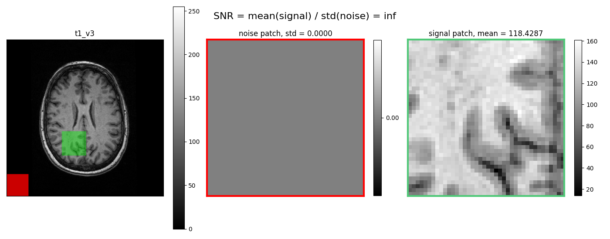
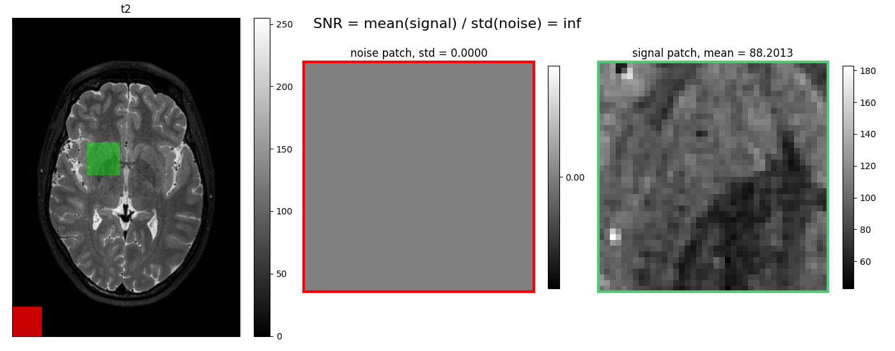
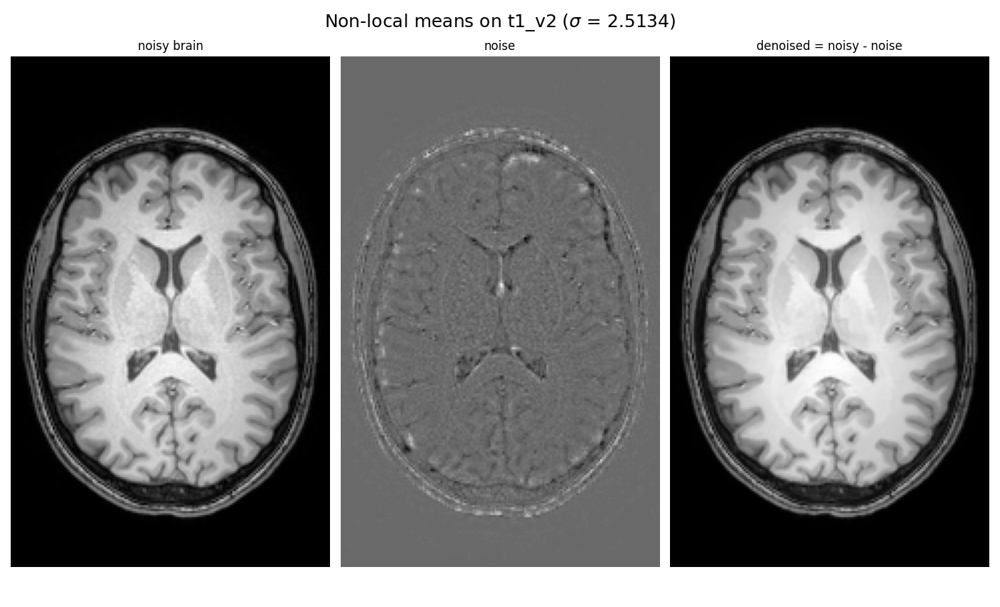
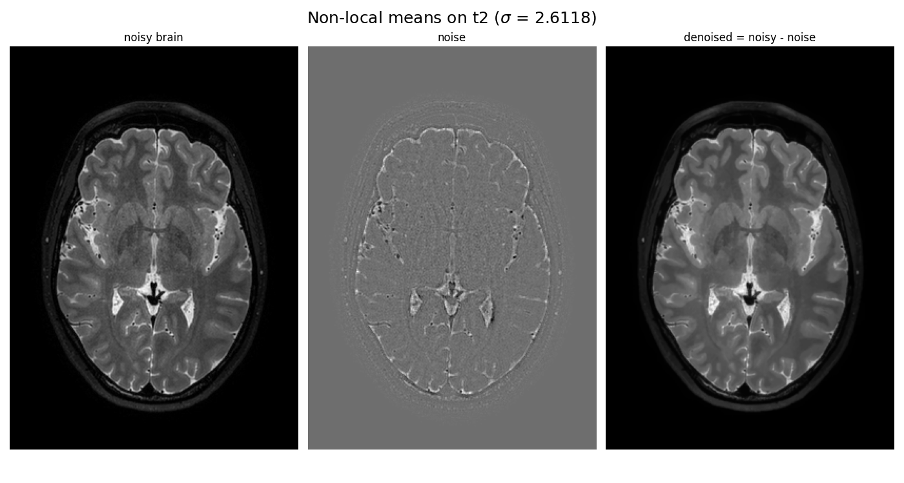
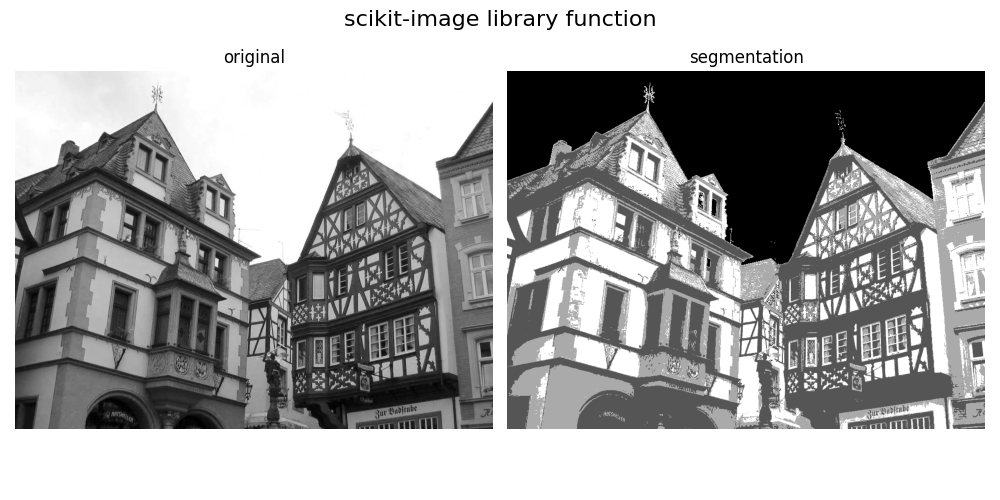
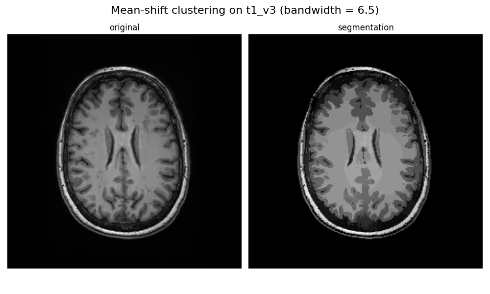
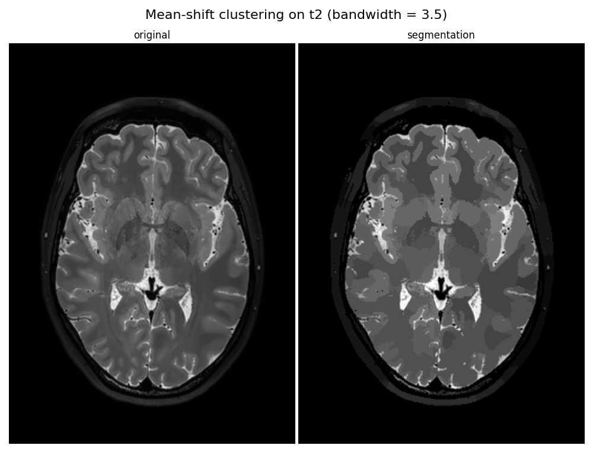
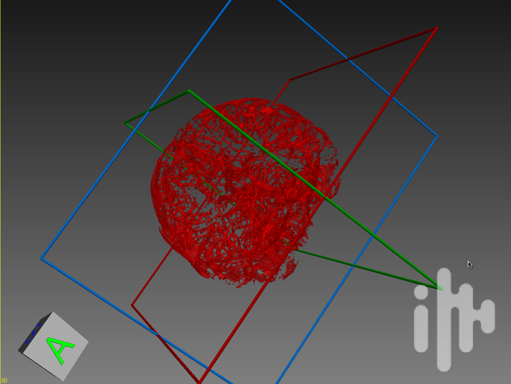
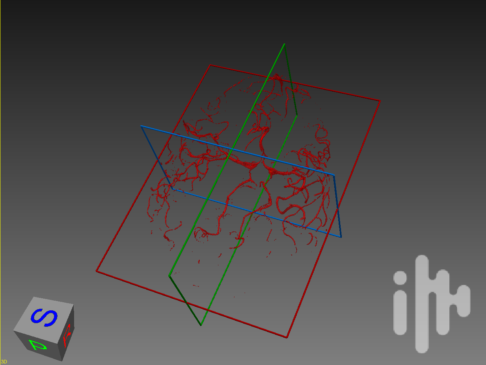

# Lab 4

Image enhancement and segmentation using mathematical approaches. (deep learning techniques may produce better results)

## Part 1: image enhancement - denoising

**Implement a non-local denoising algorithm such as bilateral filtering, non-local means or a denoising autoencoder, estimate SNR and test your algorithm on the images provided. Do not call functions from libraries such as `scipy` or `dipy`.**

Given the 5 MRI brain images, we extract a square patch from both the background and within the brain. While the patch inside the brain area is a signal patch, the patch in the background does not receive MRI signals so it can be viewed as a noise patch. We can roughly estimate the signal-to-noise ratio by taking the division of the two patches, where numerator is the mean of the signal and denominator is the standard deviation of the noise. Depending on where we extract the patches, the estimate is going to vary a bit, but overall this gives us a reasonable measure of SNR.

In the figure below, each noise patch is highlighted in red and signal patch in green, zoomed in to show the details inside the patch. As we can see, `t1_v2.png` only contains little noise so SNR is high (766.75), `flair.png` contains much more noise so SNR is relatively low (183.52).







The other three images have a perfectly clean noise patch in the background, so the standard deviation is constant 0 (that's why colorbar fails), yielding a SNR of infinity, which is a little bit counterintuitive. In fact, in this case, the above estimate approach does not work, we cannot simply take a square from the background as the noise patch. Instead, we must zoom in the brain to pick a meaningful noise patch. Ideally, such a patch should be taken from a large flat tissue where all pixels have almost identical intensity values, so that most variations within the patch are attributed to noise. However, it may be difficult to choose such a flat patch, we are likely to end up with a patch being too small in size, which comes at the price of losing information.

---

Image enhancement aims to improve the visual quality of a digital image, which can be measured in metrics such as MSE, SNR or PSNR. Here to denoise the image, we implement the non-local means algorithm as a nonlinear filter. As a unit test, we compared our algorithm to the library function from `skimage`, the result is shown below. Our denoised image is less cleaner, with some noise blurred rather than completely eliminated, and some features removed as well, but the overall performance is acceptable.


Below is the code snippet of our implementation. Here we are using a 3x3 small patch and a 5x5 search window. According to the experimental studies in [this paper](http://web.csulb.edu/~ssodagar/non%20local%20means.pdf), these parameters tend to produce the optimum results. In brief, we simply iterate over each pixel in the original image, decide the search window position, then for each pixel in that window, we compute the weight based on the patch distance between the two pixels, and finally update the original pixel value as a weighted sum of all pixels within its search window.

<details>
<summary>View code</summary>

```python
@ExecutionTimer
def nl_means_filter(im, patch_size=3, window_size=5, h=0.6, sigma=1.0, kernel='Oracle'):
    """Denoise the input image using non-local means filter
       h:      parameter that controls the degree of filtering
       sigma:  standard deviation of the Gaussian noise in the image
    """
    # use a symmetric patch and search window whose size is odd
    if patch_size % 2 == 0:
        patch_size += 1
    if window_size % 2 == 0:
        window_size += 1

    n_row, n_col = im.shape
    offset = patch_size // 2  # offset from the patch center

    new_im = np.zeros_like(im)  # initialize the denoised image
    pad_im = np.pad(im, ((offset, offset), (offset, offset)), mode='reflect')  # pad the image

    # compute the patch filter (the weighted matrix defined by the kernel)
    patch_range = np.arange(-offset, offset + 1)
    x, y = np.meshgrid(patch_range, patch_range, indexing='ij')

    if kernel == 'Oracle':
        filt = oracle_kernel(x, y)
    else:
        filt = gaussian_kernel(x, y, sigma)

    # iterate over each pixel in the original image
    for row in range(n_row):
        u = row - min(window_size, row)          # search window top row (up)
        d = row + min(window_size, n_row - row)  # search window bottom row + 1 (down)

        for col in range(n_col):
            l = col - min(window_size, col)          # search window leftmost column
            r = col + min(window_size, n_col - col)  # search window rightmost + 1 column

            p1 = pad_im[row:row+patch_size, col:col+patch_size]

            Z = 0.0
            pixel_value = 0.0

            # iterate over every other pixel in the search window
            for i in range(u, d):
                for j in range(l, r):
                    p2 = pad_im[i:i+patch_size, j:j+patch_size]

                    # compute distance and weight
                    distance = patch_distance(p1, p2, filt)
                    power = -distance / (h ** 2)
                    if power < -5:  # exp cutoff
                        weight = 0  # exp of a large negative number is close to 0
                    else:
                        weight = np.exp(power)

                    Z += weight  # the normalization term (sum of weight)
                    pixel_value += weight * im[i, j]

            # normalize the result
            if Z == 0:  # this happens only when p1 = every p2 in the search window (probably in the background)
                new_im[row, col] = im[row, col]
            else:
                new_im[row, col] = pixel_value / Z

    return new_im
```
</details>

In concrete, the patch distance is a weighted sum of all Euclidean distances between two corresponding pixels, this is exactly the essence of non-local means, whose idea is to weigh each pixel in the patch differently, taking into account the nonlinear relationship between nearby pixels.

<details>
<summary>View code</summary>

```python
def patch_distance(p1, p2, kernel):
    """Compute the sum of kernel-weighted Euclidean distances between two patches"""
    assert p1.shape == p2.shape, "Patch sizes are not equal ..."
    assert p1.shape[0] == p1.shape[1], "Input patch must be a square matrix ..."
    assert p1.shape[0] % 2 != 0, "Patch size must be odd ..."
    diff = (p1 - p2) ** 2
    return np.sum(np.multiply(kernel, diff))
```
</details>

It is worth mentioning that we are not using the default Gaussian kernel in this implementation. Instead, we used an Oracle kernel as the weight filter and it produced better results, as mentioned in [this paper](https://hal.inria.fr/hal-01575918/document) (p.7). In this case, the estimated pixel value is updated by the formula below, which is very similar to the original non-local means formula.


The Oracle kernel profile is defined as:


which has the shape of a bell-like pyramid:

<details>
<summary>View code</summary>

```python
def oracle_kernel(x, y):
    """Compute the filter matrix of meshgrid x and y given the Oracle kernel"""
    offset = x.shape[0] // 2
    dist = np.maximum(np.abs(x), np.abs(y))  # orthogonal distance from the patch center
    dist[offset, offset] = 1  # patch center has the same weight as pixels with distance = 1
    filt = np.zeros_like(x).astype('float64')
    for d in range(offset, 0, -1):
        mask = (dist <= d)
        filt[mask] += (1 / (2 * d + 1) ** 2)

    return filt * (1 / offset)
```
</details>


Applying our non-local means on the provided noisy brain images, we obtain the following result. If we zoom in, we can clearly see that the denoised images are much better in terms of visual perceptibility. However, the performance is sub-optimal as some of the features (brain structure) have been removed as well, the implementation still needs to be refined.








## Part 2: image segmentation

**Implement a segmentation algorithm such as Otsu’s method, watershed transform, region growing, mean-shift clustering and graph-cut, or a neural network model. Test on the images provided and comment on the performance. Do not call functions from libraries such as `scipy` or `dipy`.**

In this part, we implemented the mean-shift clustering algorithm for the purpose of image segmentation. This is a nonparametric clustering technique that does not require prior knowledge of the number of clusters, so the algorithm is highly automatic. In contrast, k-means usually needs to predefine the number of clusters using the elbow method, watershed requires a number of manually labelled markers to achieve best result. Here's a snapshot of our code.

<details>
<summary>View code</summary>

```python
@ExecutionTimer
def mean_shift(im, bandwidth):
    n_row, n_col = im.shape
    pixels = np.ravel(im).astype('float64')
    clusters = np.copy(pixels)
    var = bandwidth ** 2

    # vectorize to speed up exponent computation
    fast_exp = lambda x: np.exp(x) if x > -5 else 0.0
    vec_exp = np.vectorize(fast_exp)

    # obtain (flattened) indices of neighbor pixels given a flattened index
    def neighbor_indices(index, offset):
        row, col = index // n_col, index % n_col
        u = max(row - offset, 0)          # neighbor window top row
        d = min(row + offset, n_row - 1)  # neighbor window bottom row
        l = max(col - offset, 0)          # neighbor window leftmost column
        r = min(col + offset, n_col - 1)  # neighbor window rightmost column
        x, y = np.meshgrid(np.arange(u, d + 1), np.arange(l, r + 1), indexing='ij')
        return np.ravel(x * n_col + y)

    # compute shift vector for each pixel
    for i in range(len(pixels)):
        pixel = clusters[i].copy()  # initial value
        neighbor = neighbor_indices(i, 10)  # speed up by choosing a window, window size tunable

        # shift pixel until a cluster peak is hit
        while True:
            neighbor_pixel = pixels[neighbor]
            diff = (pixel - neighbor_pixel) ** 2
            power = -diff / (2 * var)
            prob = vec_exp(power)
            prob *= (1 / np.sum(prob))  # normalize

            center = np.sum(np.multiply(neighbor_pixel, prob))  # compute window center
            update = np.abs(center - pixel)
            pixel = center  # shift pixel
            # neighbor = ...  # should shift window as well, but ignored for now

            if update < CONVERGE_THRESHOLD:
                clusters[i] = pixel  # peak of the i-th pixel
                break

    clusters = (clusters / CLUSTER_THRESHOLD).astype(int) * CLUSTER_THRESHOLD  # merge similar clusters
    clusters = np.minimum(clusters + 30, 254) % 255  # for better visualization
    return clusters.reshape((n_row, n_col))
```
</details>

In brief, we simply iterate over each pixel in the image, compute its mean shift vector by looking at all other pixels, and then shift (update) the pixel until converge. The mean shift vector always points toward the direction of the maximum increase in the probability density function, so it is guaranteed to converge to a point where the gradient of density is close to zero.

The biggest bottleneck of our algorithm is the running time. When it comes to image segmentation, in our case we want to group pixels into a few clusters based on intensity similarity, so the feature space is only 1-dimensional (the grayscale intensity), but the number of pixels is very large. For example, a 512x512 grayscale image has 262,144 pixels, which would require trillions of pixel-level computations, or hundreds of hours of execution time. This makes scalability a serious issue especially for large images.

To accelerate our algorithm, we have adopted a moving window of reasonable radius. Therefore, in each iteration, we compute the "mass" center of that window, shift the pixel towards the center, and then shift the window as well. A small window size would drastically reduce the running time, but at the cost of introducing segmentation errors. With this improvement, our algorithm takes about 2 minutes to run on the images provided. Another speedup strategy is to cache the cluster of pixels in the basin of attraction, so that once we reached a pixel in the basin that has already been visited, we can break out of the inner loop and assign it to the previously computed cluster, but this is difficult and I haven't yet figured out how.

Again as a unit test, we compared our algorithm to the library function from `skimage`:




The figures below show the segmentation on the provided images using our naive implementation.







In our case, the final clusters look fine but the gray matter has not been fully isolated from the skin, where pixel intensities are on a similar level. To separate these local segments, the spatial version algorithms such as watershed or region growing would be more effective (so that non-adjacent regions would be discovered as different clusters).

## Part 3: vascular segmentation

**Segment arteries from the TOF modality image, veins from the SWI modality image and visualize the result.**

**1. preprocess**

Since segmentation is sensitive to noise, it is necessary to denoise and remove artifacts from the MRI images. First, we remove the skull from both `swi` and `tof` images and create a binary brain mask, then we denoise the image using `denoise.nlmeans` from the `dipy` library.

```bash
bet swi.nii bet_swi.nii.gz -f 0.5 -m
bet tof.nii bet_tof.nii.gz -f 0.05 -m  # dark tof needs a small threshold
```

```python
from dipy.denoise.nlmeans import nlmeans_3d, nlmeans
from dipy.denoise.noise_estimate import estimate_sigma
import nibabel as nib

def preprocess(nifti, name):
    """Preprocess the 3D MRI image before image segmentation"""
    image = nifti.get_fdata()
    sigma = estimate_sigma(image, N=16)  # N: number of coils in the receiver of the MRI scanner
    denoised = nlmeans(image, sigma)
    denoised_nifti = nib.Nifti1Image(denoised, nifti.affine)
    nib.save(denoised_nifti, f'lab4/data/clean_{name}.nii.gz')
    
swi = nib.load('lab4/data/invert_swi.nii.gz')
tof = nib.load('lab4/data/bet_tof.nii.gz')
preprocess(swi, 'swi')
preprocess(tof, 'tof')
```


**2. image segmentation**

When it comes to vascular segmentation, deep learning techniques can be very powerful to complete the task. In particular, convolutional neural networks adopting the U-Net algorithm or alike seem to be very popular on the internet. However, due to the limited time frame as well as the study cost associated with libraries such as Keras and TensorFlow, here we would like to keep things simple by just using the k-means algorithm.

In a nutshell, our main procedures are as follows:
- slice the 3D image into a list of 2D numpy arrays.
- for each 2D image slice, segment blood vessels using k-means from [OpenCV](https://opencv.org/).
- find out the cluster id of blood vessels (cluster with largest intensity values)
- set all pixels within that cluster to 255 and others to 0.
- combine all slices back to 3D and save as a nifti image.

Before we proceed, we need to invert the intensity values of the `swi` image so that veins appear bright in the brain. To do so, we subtract 255 from all voxels and take the negative, then multiply by the image mask (otherwise the black background would also become bright).

```bash
# this is done before the preprocess
fslmaths bet_swi.nii.gz -sub 255 -mul -1 -mul mask_swi.nii.gz invert_swi.nii.gz
```

Then, we run the pipeline above, which calls the `cluster()` function to segment vessels slice by slice.

<details>
<summary>View code</summary> 

```python
def cluster(nifti, name):
    """Segment the 3D image slice by slice, then merge all slices and save as nifti"""
    n_cluster = 7  # number of clusters
    image = nifti.get_fdata(dtype=np.float32)

    for i, slice in enumerate(image):
        data = slice.reshape((-1, 1))
        vessel, vessel_id = max(data), np.argmax(data)  # vessel is the brightest pixel
        if vessel < 10:  # slice has no vessels (perhaps outside the brain)
            image[i, ...] = 0  # enforce binary property so as to view polygon model in imeka
            continue

        criteria = (cv.TERM_CRITERIA_EPS + cv.TERM_CRITERIA_MAX_ITER, 30, 1)
        _, labels, _ = cv.kmeans(data, n_cluster, None, criteria, 10, cv.KMEANS_RANDOM_CENTERS)
        cluster_id = labels[vessel_id]  # cluster id of all vessels

        data[labels == cluster_id] = 255
        data[labels != cluster_id] = 0
        image[i, ...] = data.reshape(slice.shape)

    output = nib.Nifti1Image(image, nifti.affine)
    nib.save(output, f'lab4/data/out_{name}.nii.gz')
```
</details>

After image segmentation, the result loaded into [afni]() would look like this:


For better visualization, we can load the output images into the `mibrain` software (made by [Imeka](https://www.imeka.ca/mi-brain/)), create a polygon and then display it as a 3D movable model. This way, it is possible to view the vessel structures from any perspective, which leads to the following visualization. One thing to note is that the polygon can only be created if the image has binary property, meaning that all voxels must have only two unique values (0 or 255, for example), this property is enforced in our code.

- Visualization of veins from `swi`:



- Visualization of arteries from `tof`:




## Reference

[1] Alireza Nasiri Avanaki, Abolfazl Diyanat, Shabnam Sodagari, 2008. "Optimum parameter estimation for non-local means image de-noising using corner information". In ICSP2008 Proceedings, pp. 861-863.

[2] Qiyu Jin, Ion Grama, Charles Kervrann, Quansheng Liu. "Non-local means and optimal weights for noise removal". SIAM Journal on Imaging Sciences, Society for Industrial and Applied Mathematics, 2017. hal-01575918